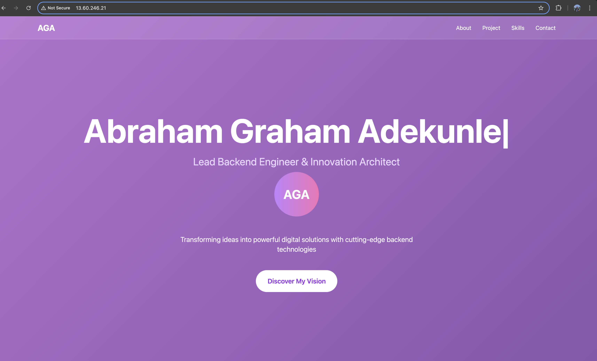

# AltSchool Landing Page Deployment

This repository contains the source code and complete instructions for deploying the AltSchool landing page to a production-ready server using AWS EC2 and Nginx.

---


## 📸 Screenshot



---


## 🖥️ Server Setup

**Cloud Provider:** Amazon Web Services (AWS)  
**Instance Type:** EC2 (Ubuntu 22.04)  
**Purpose:** Hosting a static landing page

### Setup Steps:

1. **Launch EC2 Instance** with Ubuntu 22.04
2. **Configure Security Group** to allow:
   - HTTP (Port 80)
   - HTTPS (Port 443)
   - SSH (Port 22)

3. **Connect to the server** via SSH:
   ```bash
   ssh -i {{my-key}}.pem ubuntu@your-ec2-ip
   ```

4. **Update system packages**:
   ```bash
   sudo apt update && sudo apt upgrade -y
   ```

---

## 🌐 Web Server Setup

**Web Server:** Nginx

### Installation Steps:

1. **Install Nginx**:
   ```bash
   sudo apt install nginx -y
   ```

2. **Start and enable Nginx**:
   ```bash
   sudo systemctl start nginx
   sudo systemctl enable nginx
   ```

3. **Verify Nginx is running**:
   ```bash
   sudo systemctl status nginx
   ```

---

## 🚀 Deployment Process

### File Upload and Configuration:

1. **Upload landing page files** to the server directory:
   ```
   /home/ubuntu/altschool/altschool-project-landing-page/
   ```

2. **Create Nginx configuration file**:
   ```bash
   sudo nano /etc/nginx/sites-available/altschool
   ```

3. **Add the following server configuration**:
   ```nginx
   server {
       listen 80;
       server_name {{server_ip}};

       root /home/ubuntu/altschool/altschool-project-landing-page;
       index index.html;

       location / {
           try_files $uri $uri/ =404;
       }

       # Optional: Add security headers
       add_header X-Frame-Options "SAMEORIGIN" always;
       add_header X-XSS-Protection "1; mode=block" always;
       add_header X-Content-Type-Options "nosniff" always;

       # Optional: Enable gzip compression
       gzip on;
       gzip_vary on;
       gzip_min_length 1024;
       gzip_types text/plain text/css text/xml text/javascript application/javascript application/xml+rss application/json;
   }
   ```

4. **Enable the site configuration**:
   ```bash
   sudo ln -s /etc/nginx/sites-available/altschool /etc/nginx/sites-enabled/
   ```

5. **Remove default Nginx site**:
   ```bash
   sudo rm /etc/nginx/sites-enabled/default
   ```

6. **Test Nginx configuration**:
   ```bash
   sudo nginx -t
   ```

7. **Restart Nginx to apply changes**:
   ```bash
   sudo systemctl restart nginx
   ```

---

## 🔧 Additional Configuration

### Setting Proper File Permissions:
```bash
sudo chown -R www-data:www-data /home/ubuntu/altschool/altschool-project-landing-page/


sudo chmod -R 755 /home/ubuntu/altschool/altschool-project-landing-page/
sudo chmod 644 /home/ubuntu/altschool/altschool-project-landing-page/index.html
```

### Firewall Configuration (if UFW is enabled):
```bash
sudo ufw allow 'Nginx Full'
sudo ufw allow OpenSSH
sudo ufw enable
```

---

## 🔍 Verification and Testing

### Check Nginx Status:
```bash
sudo systemctl status nginx
```

### View Nginx Access Logs:
```bash
sudo tail -f /var/log/nginx/access.log
```

### Test Configuration:
```bash
curl -I http://{{server_ip}}/
```

---

## ✅ Deployment Result

The landing page is now live and accessible at:

**🌐 Live URL:** [http://13.60.246.21/](http://13.60.246.21/)


## 👨‍💻 Author

**Abraham Graham Adekunle**  
- **Email:** adekunleabraham09@gmail.com
- **GitHub:** [https://github.com/NoBoneZ](https://github.com/NoBoneZ)
- **Phone:** +234 701-982-9316


